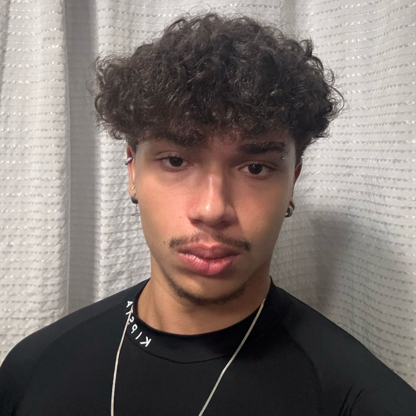

<h1 align="center">⚽ Sistema IoT de Monitoramento de Gols</h1>
<h3 align="center">Projeto desenvolvido pela <strong>Nova Tech Global</strong></h3>

  
  
  
  

---

## 📌 Objetivo do Projeto

Trazer **profissionalismo e inovação** aos campeonatos do Passa a Bola, utilizando aplicações de **IoT em tempo real**, permitindo:

- Captura da **velocidade do chute** das jogadoras  
- **Detecção automática de gols** por sensores instalados no gol  
- Sistema de câmeras capaz de **clippar os últimos 15 segundos antes do gol**  
- Exibição instantânea do **replay do lance**, junto com:
  - Velocidade do chute ⚡  
  - Confirmação do gol ✅  
  - Nome da jogadora responsável 🏃‍♀️  

---

## ⚙️ Tecnologia e Componentes

| Componente            | Função                                                                 |
|------------------------|------------------------------------------------------------------------|
| 🟥 **Node-RED**            | Plataforma IoT para orquestração dos dispositivos e fluxos de dados |
| 📡 **Sensores no Gol**     | Detectam a passagem da bola e calculam a velocidade do chute        |
| 🎥 **Sistema de Câmeras**  | Registra e clippa automaticamente os 15s anteriores ao gol          |
| 🌐 **MQTT Broker**         | Protocolo de comunicação entre sensores e plataforma IoT            |
| 🖥 **Dashboard IoT**       | Exibe velocidade, replay e informações do gol em tempo real          |

---

##  Como Funciona

### Captura do Gol

1. **Sensores instalados no gol** detectam a entrada da bola e medem a velocidade.  
2. Os dados são enviados via **MQTT** para a plataforma **Node-RED**.  
3. A jogadora responsável pelo gol é identificada e registrada no sistema.  

### Replay Automático

- Ao confirmar o gol, o sistema de câmeras:  
  - Clippa os últimos **15 segundos de jogo**  
  - Gera o replay com informações sobre:  
    - Nome da jogadora  
    - Velocidade do chute  
    - Status da validação do gol  

---

## Interface IoT

O **Dashboard do Node-RED** exibirá em tempo real:

1. **Velocidade do chute**  
2. **Nome da jogadora**  
3. **Status do gol** (Validado / Não validado)  
4. **Replay dos 15 segundos anteriores**  

⏱️ **Atualização instantânea a cada evento de gol.**

---

## 🚨 Alertas e Funcionalidades

| Situação                    | Ação no Sistema                                               |
|-----------------------------|--------------------------------------------------------------|
| Gol confirmado              | ✅ Registro + Replay + Velocidade exibida no dashboard        |
| Gol não confirmado           | ❌ Notificação de erro no dashboard                          |
| Velocidade acima da média    | ⚡ Destaque especial no replay (chute mais forte)             |
| Jogadora identificada        | 🏃‍♀️ Nome exibido junto ao replay do lance                   |

---

## Simulação

  

<strong>🎬 Demonstração do Sistema Passa a Bola IoT</strong>

## 🖼️ Imagem da Arquitetura

  

---

## 👥 Integrantes do Grupo

| [ Vitor Alcantara](https://github.com/VitorAlcantara-tech) | [ Thiago Lima](https://github.com/thiagolima-tech) | [ Matheus Vasques](https://github.com/maatvasques) | [ Marco Aurélio](https://github.com/Arriatea) | [ Bernardo Hanashiro](https://github.com/BernardoYuji) |
| :---: | :---: | :---: | :---: | :---: |
